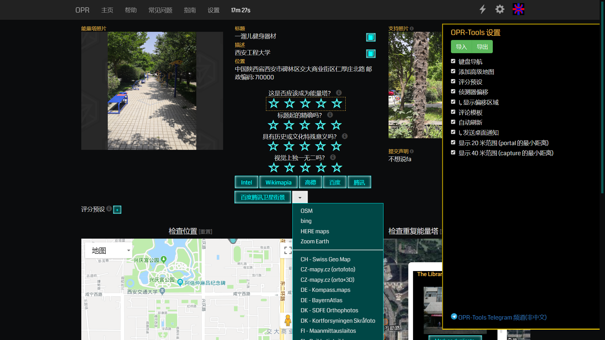
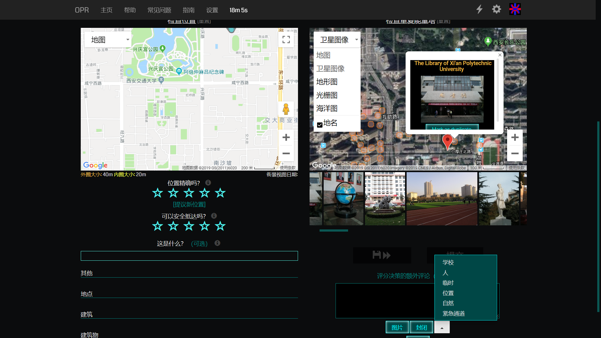
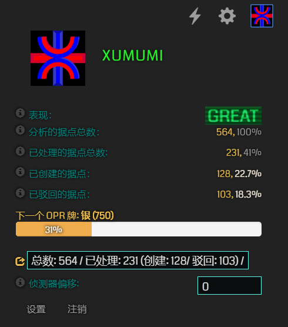

# OPR-Tools-zh_CN

[Ingress - Operation Portal Recon](https://opr.ingress.com/recon) 的用户脚本

本项目由 Gitlab 上的 [opr-tools](https://gitlab.com/1110101/opr-tools/) 修改而来

## 安装

OPR-Tools 在 Chrome 和 Firefox 上进行测试。 你需要一个脚本管理器比如 [Tampermonkey](https://tampermonkey.net/) (如果你在用 IITC 那么你很可能已经有脚本管理器了) OPR-Tools 不适用于 Firefox 的 Greasemonkey。

> **下载:** https://raw.githubusercontent.com/XUMUMI/OPR-Tools-zh_CN/master/OPR-Tools-zh_CN.js

## 功能:
- 添加第三方地图按钮，如高德地图、百度地图等
 - 创建自己的预设以提升效率。 OPR-Tools 不包括任何预设以表示中立。
 - 自动打开第一个列出的可能副本和“这是什么？” 过滤文本框
 - 评论框上方的按钮可自动输入常见的 *1星* 拒绝原因
 - 处理的据点总数的百分比
 - 翻译标题和说明的文本按钮
 - 将总评分位置移动至其他评分上方
 - 将门户标记更改为小圆圈, 灵感来自IITC风格
 - 使用鼠标滚轮滚动 "检查重复能量塔" 列表
 - 如果长时间没有审 portal，则刷新页面
 - 在候选据点周围显示20米和40米的圈
 - 导航栏中显示到期计时器
 - 键盘导航

## 键盘导航

您可以使用键盘完全控制页面，如下所示:

|           按键            |              功能               |
| :-----------------------: | :-----------------------------: |
|  数字键 1-5, 小键盘 1-5   | 为当前字段进行评分 (黄色框部分) |
|        Shift + 1-5        | 应用自定义的预设评分 (如果存在) |
|             D             | 标记为所选 portal 的重复 portal |
|             T             |       打开标题的翻译窗口        |
|             Y             |       打开描述的翻译窗口        |
|  空格, 回车, 小键盘回车   |       确认对话框/发送评估       |
|       Tab, 小键盘+        |           下一个字段            |
| Shift, Backspace, 小键盘- |           上一个字段            |
|       Esc, 小键盘/        |           第一个字段            |
|        ^, 小键盘*         |    跳过该 portal (如果可用)     |
